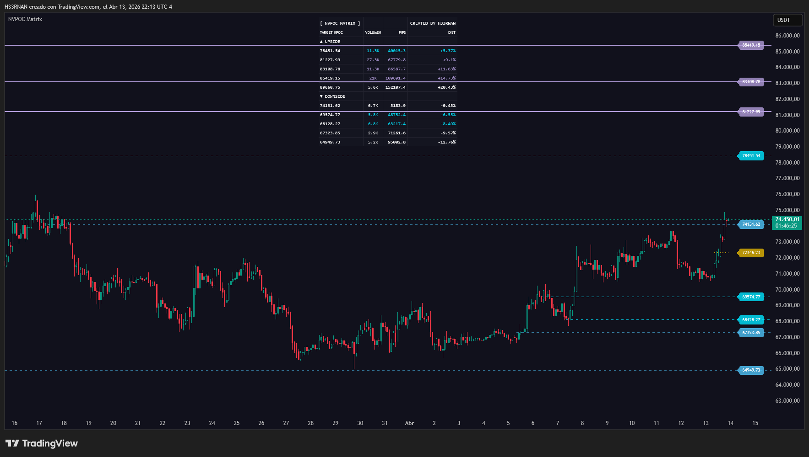

# 🕸️ NVPOC Matrix [Quant Engine]

> Created by H33RNAN | Technical tools & algorithm builder._

**[🇪🇸 Español]**
El volumen no desaparece, deja huellas magnéticas. El "Naked Volume Point of Control" (NVPOC) es el nivel de precio donde se ejecutó el mayor volumen de una sesión y que aún no ha sido re-testeado. Este algoritmo no es un simple dibujador de perfiles; es un motor cuantitativo orientado a objetos que escanea la micro-estructura, aísla el Horario Regular (RTH) y gestiona la liquidez viva.

### ⚙️ Core Engineering
1. **MTF Micro-Structure Binning:** Extrae datos del timeframe menor (ej. 5m) usando `request.security_lower_tf` para calcular con precisión balística la distribución del volumen dentro de la sesión macro, dividiéndolo en 250 "bins" (cajas de liquidez).
2. **RTH Isolation:** Filtra el ruido fuera de horario. Solo acumula volumen durante el Regular Trading Hours (RTH) de Nueva York, capturando la verdadera intención institucional.
3. **OOP Memory & Ghosting/Annihilation:** Construido con matrices orientadas a objetos (`type NVPOC`). Si el precio toca un nivel virgen, el usuario decide: o la línea muere (Aniquilación) para un gráfico inmaculado, o entra en degradación cinética (Ghosting).
4. **GPS Combat HUD:** Un panel táctico flotante (Top Center, Bottom Right, etc.) que ordena dinámicamente todos los NVPOCs vivos. Muestra la distancia en pips, porcentaje y volumen acumulado, coloreado bajo el estándar institucional ARTIC/MONO.

---

**[🇬🇧 English]**
Volume doesn't disappear; it leaves magnetic footprints. The "Naked Volume Point of Control" (NVPOC) is the price level with the highest volume in a session that hasn't been retested yet. This is not a simple profile drawer; it is an object-oriented quantitative engine that scans micro-structure, isolates Regular Trading Hours (RTH), and manages live liquidity.

### ⚙️ Core Engineering
1. **MTF Micro-Structure Binning:** Extracts lower timeframe data (e.g., 5m) via `request.security_lower_tf` to calculate volume distribution with ballistic precision, dividing it into 250 liquidity bins.
2. **RTH Isolation:** Filters out-of-hours noise. It only accumulates volume during NY Regular Trading Hours, capturing true institutional intent.
3. **OOP Memory & Ghosting/Annihilation:** Built with object-oriented arrays (`type NVPOC`). If price touches a virgin level, the user decides: either the line is destroyed (Annihilation) for a pristine chart, or it enters kinetic degradation (Ghosting).
4. **GPS Combat HUD:** A floating tactical panel that dynamically sorts all alive NVPOCs. Displays pip distance, percentage, and accumulated volume, styled under the institutional ARTIC/MONO standard.

---

### ⚖️ License & Disclaimer
**License:** GNU Affero General Public License v3.0 (AGPLv3)

⚠️ **RISK DISCLAIMER**
*The NVPOC Matrix is a quantitative analysis tool strictly for educational and algorithmic research purposes. It is NOT financial advice. The author is not responsible for any financial loss incurred by the use of this code.*
